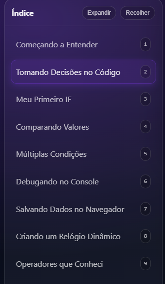
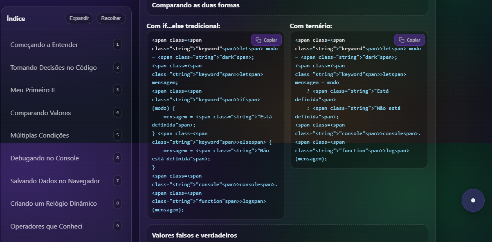
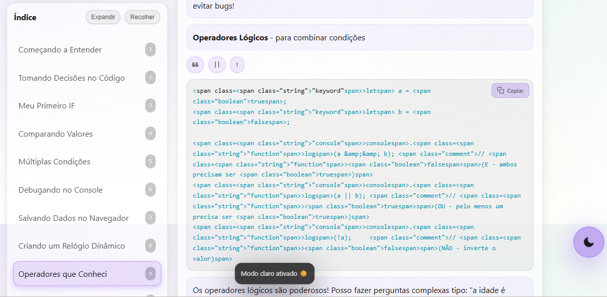

# Sintaxe Básica, Operador Ternário e Valores Falsos e Verdadeiros


---

## Sobre o Projeto

Este site foi desenvolvido com o intuito de documentar e demonstrar o aprendizado adquirido durante a aula de JavaScript ministrada pelo Professor Luan da GoDev, especificamente sobre o tema "Sintaxe Básica, Operador Ternário e Valores Falsos e Verdadeiros".

O objetivo principal é apresentar de forma prática e interativa os conceitos fundamentais abordados na aula, servindo como material de consulta e demonstração do conhecimento adquirido.

---

## Acesso ao Site

O site está disponível online 24/7 através do GitHub Pages:

**URL:** https://guielihan.github.io/sintaxe-basica-javascript/

*(Após a publicação, o link estará ativo)*

---

## Visualização do Site

### Tela Principal


### Navegação Lateral


### Exemplos de Código


### Modo Claro


---

## Conteúdo Abordado

* Estruturas Condicionais (if, else if, else)
* Operadores de Comparação
* Operadores Lógicos (&&, ||, !)
* Switch Case
* Operador Ternário
* Local Storage
* setInterval
* Valores Truthy e Falsy
* Debug com Console

---

## Estrutura do Projeto

```
.
|-- index.html       - Página principal com conteúdo
|-- styles.css       - Estilos e animações
|-- script.js        - Lógica JavaScript organizada em módulos
|-- README.md        - Documentação do projeto
```

---

## Funcionalidades Implementadas

* Interface moderna com gradientes animados
* Relógio dinâmico atualizado em tempo real
* Demonstração prática de localStorage
* Navegação por teclado (teclas 1-9, 0, T, C)
* Design responsivo
* ScrollSpy que destaca a seção atual
* Sistema de notificações (toast)
* Botões de copiar código
* Syntax highlighting para código
* Alternância entre modo claro e escuro

---

## Como Executar Localmente

1. Clone este repositório:
   ```
   git clone https://github.com/Guielihan/sintaxe-basica-javascript.git
   ```

2. Navegue até a pasta do projeto:
   ```
   cd sintaxe-basica-javascript
   ```

3. Abra o arquivo index.html no seu navegador

---

## Atalhos de Teclado

* Teclas 1-9, 0, T, C - Navegar para seções específicas
* Tecla / - Dica de busca
* Botões Expandir/Recolher - Controles no menu de navegação

---

## Tecnologias Utilizadas

* HTML5 - Estrutura semântica da página
* CSS3 - Estilização com animações e gradientes
* JavaScript (ES6+) - Lógica e interatividade
* Intersection Observer API - ScrollSpy
* Local Storage API - Persistência de dados
* Clipboard API - Funcionalidade de copiar código
* Date API - Relógio dinâmico

---

## Desenvolvedor

**Guilherme Queiroz**

* Discord: @guielihan
* Email: guielihan@outlook.com
* GitHub: @Guielihan

---

## Orientação

**Professor Luan** - GoDev

Curso: Geração Tech

---

## Notas

Este projeto foi desenvolvido exclusivamente para fins educacionais, como parte do processo de aprendizado em JavaScript. O código e a estrutura refletem os conceitos ensinados durante a aula sobre sintaxe básica, operador ternário e valores falsos e verdadeiros.
